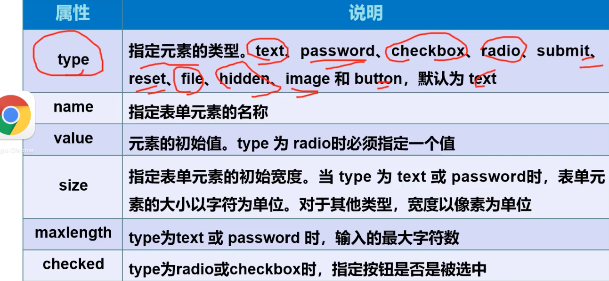

# 什么是HTML

超文本标记语言 Hyper Text Markup Language


- 结构化标准语言
- 表现标准语言
- 行为标准


# 网页基本信息

```html
<!DOCTYPE html>
<html lang="en">
<head>
    <meta charset="UTF-8">
    <title>Title</title>
</head>
<!--主体-->
<body>
我的第一个网页
</body>
</html>

```


- 注释

  ```html5
  <!-- -->
  ```
  
- 告诉浏览器类型

  ```html5
  <!DOCTYPE html>
  <!DOCTYPE:告诉浏览器使用什么规范>
  ```

  

## 头部

```html
<head>
    <meta charset="UTF-8">
    <meta name="keywords" content="java">
    <meta name="description" content="学习" >
    <title>Title</title>
</head>
```

- `meta标签`：描述网站的一些信息，一般用来做SEO


## 网页基本标签

- 标题标签

  ```html
  <h1>
    一级标题
  </h1>
  
  <h2>
    二级标题
  </h2>
  ```

- 段落标签

  ```html
  <p>
   两只老虎，两只老虎
  </p>
  <p>
   跑的快
  </p>
  ```

  

- 换行标签

  ```html
  <!--换行标签-->
  一直没有耳朵<br/>
  ```

- 字体样式标签

  ```html
  <hr/> //水平线
  <h1>
    字体样式标签
  </h1>
  
  <strong>粗体</strong>
  <em>斜体</em>
  ```

- 特殊符号
  - `&nbsp;`空格 
  - ``


### 图像标签

`img src="path" alt=" " title="悬停文字" width="300" height="300" `

- alt用于图片无法加载，替换名字
- title是悬停文字

### a标签

```html
<!--a标签-->
<a href="../res/1.jpeg" target="目标窗口位置">连接文本或者图像</a>

<a href="../res/1.jpeg" target="目标窗口位置">连接文本或者图像</a>
<br/>
<a href="https://www.baidu.com">打开百度</a>
```

- target表示在哪个页面打开
  - `_blank` 新标签
  - `_slef`

- 锚链接

  ```html
  <a name="top"> 顶部</a>
  ....
  <a href="#top">回到顶部</a>
  ```

  - 使用#号到属性

- 功能性连接

  - 邮件连接
  - qq连接

  ```html
  <a href="mailto:"></a>
  ```

  


### 行内元素和块元素

- 块元素
  - 无论内容多少，该元素独占一行
  - `p,h1-h6`
- 行元素
  - 内容撑开宽度，左右都是行内元素的可以在排在一行
  - `a,strong,em`

### 列表

- 有序列表 order list(ol)
- 无序列表 unorder list(ul)
- 自定义列表 （dl)

```html
<!--有序列表-->
<ol>
    <li>java</li>
    <li>python</li>
    <li>前端</li>
    <li>运维</li>
</ol>
<!--无序列表-->
<ul>
    <li>java
        <ul>
            <li>java1</li>
            <li>java2</li>
            <li>java3</li>
        </ul>
    </li>

    <li>python</li>
    <li>前端</li>
    <li>运维</li>
</ul>
<!--自定义列表-->
<dl>
    <dt>学科</dt>
    <dd>java</dd>
    <dd>python</dd>
    <dd>c</dd>

    <dt>位置</dt>
    <dd>重庆</dd>
    <dd>成都</dd>
    <dd>西安</dd>

</dl>
```


### 表格

- 单元格
- 行 : ` <tr></tr>`
- 列 :`<td></td>`
- 跨行：`rowspan`
- 跨列:`colspan`

```html
<table border="1px">
    <tr>
        <td rowspan="4">1</td>
        <td>2</td>
        <td>3</td>
        <td>4</td>
    </tr>
    <tr>
        <td>2-1</td>
        <td>2-2</td>
        <td>2-3</td>
        <td>2-4</td>
    </tr>
    <tr>
        <td>1</td>
        <td>2</td>
        <td>3</td>
        <td>4</td>
    </tr>
</table>
```

- `border`：边宽度


### 媒体元素

- video

  - src 资源路径
  - Controls：控制条
  - Autoplay:自动播放

- audio

  ```html
  <video src="../res/video/1.mp4" controls>c</video>
  <audio src="../res/video/1.mp4" controls></audio>
  ```

### 页面结构

| 元素名  | 描述                         |
| ------- | ---------------------------- |
| 头部    | <header></header>            |
| 脚部    | <footer></footer>            |
| 主体    | <section></section>          |
| article | 文章内容 <article></article> |
| aside   | 侧边栏导航                   |
| nav     | 导航类辅助                   |


### iframe内联框架


>```html
><iframe src="" name=" ">
>  
></iframe>
>```
>
>


```html
<iframe src="//player.bilibili.com/player.html?aid=55631961&bvid=BV1x4411V75C&cid=97257967&page=11" scrolling="no" border="0" frameborder="no" framespacing="0" allowfullscreen="true"> </iframe>
```


### 表单语法

```html
<form action=""></form>

<!--表单 form-->
<form action="01demo.html" method="get" value="">
    <p>名字：<input type="text" name="username"></p>
    <P>密码：<input type="password" name="pwd"></P>
  
      <p>
        <input type="submit">
        <input type="reset">
    </p>
</form>
```


- action : 表单提交位置，网站或者请求处理地址

- method: get和post 提交方式

- input标签:

  - value默认值
  - maxlength 最大字符数
  - CheckBox
  - radio
  - 

  



### 表单验证

- placeholder

- required

- patten

  ```html
      <p>名字：<input type="text" name="username" placeholder="请输入用户名" required></p>
      <P>密码：<input type="password" name="pwd" placeholder="输入密码"></P>
  ```

  