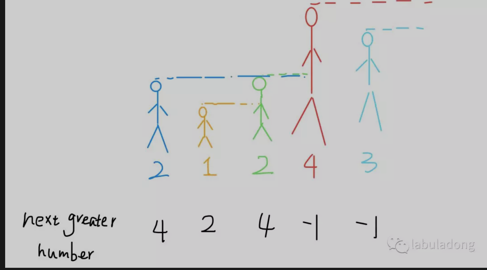

## 单调栈


什么是单调栈？

- 保持栈中元素单调，也就是说每次进栈之前我们需要判断？

- 单调栈用途不太广泛，只处理一种典型的问题，叫做 Next Greater Element。

- getNearLess获取i最近的小的值（维持从栈顶到栈底的单调递减，也就是比top大的元素进栈，小的时候就应该启动出栈程序）

其中分为是值入栈，还是下标

怎么判断该用什么顺序的？画图


模板

```cpp
从栈顶到栈底单调递减栈-则进入的肯定应该要比当前栈顶大
如果nums[i]小于top值则出栈，否则当前nums[i]大于top的值才能进栈
1.如果是值
for(int i:n)
{
  //出栈操作
  while(!st.empty()&&st.top()>nums[i]) //注意while的条件
  {
      ...
    st.pop()
      ...
  }
  push(nums[i]);//
}
```

#### [496. 下一个更大元素 I](https://leetcode-cn.com/problems/next-greater-element-i/)

```cpp
单调栈 时间复杂度o(n)
class Solution {
public:
    vector<int> nextGreaterElement(vector<int>& nums1, vector<int>& nums2) {
        stack<int> st;
        unordered_map<int,int> mp; //map保存
        vector<int> ans;
        //单调栈维护栈顶最小值，进入大的肯定是挨着的第一个大的
        for(int i=0;i<nums2.size();++i)
        {
            while(!st.empty()&&nums2[i]>st.top()) //进入的大于栈顶 出栈 不符合栈顶到栈底递增
            {
                
                mp[st.top()] = nums2[i];
              	st.pop();
            }
            st.push(nums2[i]);
        }
        for(int c : nums1)
        {
            int m = mp[c];
            ans.push_back(m==0?-1:m);
        }
        return ans;
    }
};
```


1. 给你一个数组 [2,1,2,4,3]，你返回数组 [4,2,4,-1,-1]。
   解释：第一个 2 后面比 2 大的数是 4; 1 后面比 1 大的数是 2；第二个 2 后面比 2 大的数是 4; 4 后面没有比 4 大的数，填 -1；3 后面没有比 3 大的数，填 -1。

   

```cpp

  
模板一 栈顶元素最大（即栈顶到栈底应该是递减的）
每次比较栈顶和下一个元素，如果现在这个数大于栈顶元素，就出栈 。（矮的出栈）
核心在于：每个人只能看到比自己高的后面那一个因为被挡住了
for(int i=n-1;i>=0;i--)//倒着放入栈，正着出栈
{
  while(!st.empty()&&st.top<=nums[i]) //判断高矮
  {
    st.pop();//矮的出栈
  }
  ans[i] = st.empty()?-1:st.top(); //元素后面第一个高个
  st.push(nums[i]);//入栈比身高
}
//时间复杂度O(n)
```


2. 给你一个数组 T = [73, 74, 75, 71, 69, 72, 76, 73]，这个数组存放的是近几天的天气气温（这气温是铁板烧？不是的，这里用的华氏度）。你返回一个数组，计算：对于每一天，你还要至少等多少天才能等到一个更暖和的气温；如果等不到那一天，填 0 。

   

   举例：给你 T = [73, 74, 75, 71, 69, 72, 76, 73]，你返回 [1, 1, 4, 2, 1, 1, 0, 0]。

   

   解释：第一天 73 华氏度，第二天 74 华氏度，比 73 大，所以对于第一天，只要等一天就能等到一个更暖和的气温。后面的同理。

   ```cpp
   Nextbigger num
   栈顶到栈底单调递增，所以top元素应该最小，要入栈的数应该比top元素小，才能保持栈顶最小。否则栈顶元素退栈
   for(int i=nums.size()-1;i>=0;++i)
   {
     while(!st.empty() &&nums[st.top()]<=nums[i])
     {
       st.pop(); //矮的退出
     }
     ans[i] = st.empty()? 0:(st.top-i);
     st.push(i);//加入
     
   }
   ```

   

3. 循环数组单调栈

   给你一个数组 [2,1,2,4,3]，你返回数组 [4,2,4,-1,4]。拥有了环形属性，最后一个元素 3 绕了一圈后找到了比自己大的元素 4 

   

   一般是通过 % 运算符求模（余数），获得环形特效：

   ```cpp
   int[] arr = {1,2,3,4,5};
   int n = arr.length, index = 0;
   while (true) {
       print(arr[index % n]);
       index++;
   }
   ```

   我们可以考虑这样的思路：将原始数组“翻倍”，就是在后面再接一个原始数组，这样的话，按照之前“比身高”的流程，每个元素不仅可以比较自己右边的元素，而且也可以和左边的元素比较了。

   实际实现利用求余数

   ```cpp
   //假装翻倍了
   for(int i=2*n-1;i>=0;i--)//倒着放入栈，正着出栈
   {
     while(!st.empty()&&st.top<=nums[i%n]) //判断高矮
     {
       st.pop();//矮的出栈
     }
     ans[i] = st.empty()?-1:st.top(); //元素后面第一个高个
     st.push(nums[i%n]);//入栈比身高
   }
   ```

   

   

4. 不含重复的数，找每一个i位置的左边和右边离i位置最近且值比arr[i]小的位置

   例如[2,1,4,3]，返回{{-1,1},{-1,-1},{1,3},{1,-1}};

   //小的 从0开始，维持单调栈,栈顶到栈底递减

   //同时左右都要找，说明应该进栈，出栈都要记录

   返回下标：因此栈中应该是放index

   ```cpp
   int Less(vector<int> &nums)
   {
     int n = nums.size();
     vector<vector<int>> ans(n,vector<2,0>); //记录最终的
     stack<int> st;
     for(int i=0;i<nums.size();i--)
     {
       while(!st.empty()&&nusm[st.top()]>nums[i]) //
       {
         int popIndex = st.top(); //弹出的值是当前记录的index      
         st.pop();
         int leftindex = st.empty()? -1:st.top();
         ans[popIndex][0] = leftindex;
         ans[popIndex][1] = i;
       }
       st.push(i);
     }
     
     //栈没空 说明右边没有了 只看左边的小的了
     while(!st.empty())
     {
       int popIndex = st.top(); //弹出的值是当前记录的index      
       st.pop();
       leftindex = st.empty()? -1:st.top();
       ans[popIndex][0] = leftindex;
       ans[popIndex][1] = -1;
     }
     return ans;
   }
   ```

   

5. 含重复的数，找每一个i位置的左边和右边离i位置最近且值比arr[i]小的位置

- 栈中需要存相等的数 用一个链表
- 判断时，除了比top数小，还有可能相等。相等需要处理 else if

```cpp
int Less(vector<int> &nums)
{
  int n = nums.size();
  typedef unique_ptr<list<int>> ListPtr;
  vector<vector<int>> ans(n,vector<2,0>); //记录最终的
  stack<ListPtr> st;
  for(int i=0;i<nums.size();i--)
  {
    while(!st.empty()||nusm[st.top()->front()]>nums[i]) //
    {
      //移动语义
      ListPtr popIndexs = move(st.top()); //弹出的值是当前记录的index的链表      
      st.pop();
      //取最晚加入的那一个
      int leftindex = st.empty()? -1:st.top()->back();
      //链表上面每一个位置加入
      for(auto &c : popIndexs)
      {
        ans[c][0] = leftindex;
        ans[c][1] = i;
			}
      

    }
    if(!st.empty()||nusm[st.top().front()]==nums[i])
    {
      st.top().push_back(i); //放入链表
    }
    else
    {
      //加一个新链表
      //考虑使用unique_ptr
      //因为没有涉及共享，不需要使用shared_ptr
      //auto p = make_shared<int>(42);
      //weak_ptr<list> wp(p);//用shared_ptr初始化
      ListPtr listptr(new list<int>);
      listptr->push_back(i);
      st.push(listptr);
    }
    
    st.push(i);
  }
  
  //栈没空 说明右边没有了 只看左边的小的了
  while(!st.empty())
  {
    int popIndex = st.top(); //弹出的值是当前记录的index      
    st.pop();
    leftindex = st.empty()? -1:st.top();
    ans[popIndex][0] = leftindex;
    ans[popIndex][1] = -1;
  }
  return ans;
}
```


5. 接雨水

   

最主要是看出来雨水怎么接的

`rain = min(left_max,right_max)-height;`

方法一：左右扫描记录每个点的左右最大的值存入数组


方法二：单调栈


