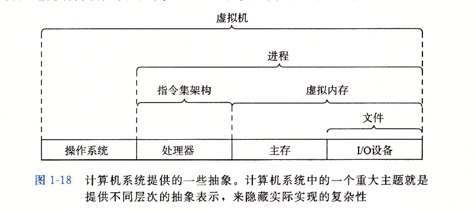

# 第一章 计算机系统漫游

## 信息就是位（bit)+上下文

位：即二进制位

怎么理解上下文呢？

- 相同的二进制位可能有不同的含义
- 都是一串比特，怎么区分？
- 例如无符号和有符号数，1开头的一模一样的字节序列代表的值大不相同！！

两种文件：

- 文本文件（ascii字符够成）
- 二进制文件

## 1.2 程序翻译

1. 预处理 使用 cpp
2. 编译  ccl将cpp生成的.i文件编译为汇编语言.s 
3. 汇编 ass将.s转为机器语言，即二进制文件（可重定位目标文件）
4. 链接 ld
5. 生成可执行目标程序

## 了解编译系统的好处

- 优化程序性能
- 理解链接时的错误
  - 无法解析一个引用
  - 全局变量和静态变量的区别是什么？
    - 只能被本模块使用
    - 未初始化时存储地方不一样
      - static变量存放在.bss（初始化为0的全局或静态）
      - 全局变量存储在COMMON
  - 两个相同的全局变量会发生什么？
  - 静态库和动态库的区别
  - 命令行的库排序顺序
  - 为什么有些链接错误运行时才报出来？
- 避免安全漏洞
  - 缓冲区溢出

## 1.4

### 硬件构成

CPU 中央处理器

- 寄存器

- 寄存器文件（小存储设备，由单个字长的寄存器组成）

- 核心：程序计数器（PC）

  - 通电
  - 执行PC指向的指令（包含很多步骤）
  - 更新PC，执向下一条
  - 循环上面两步
  - 断电

- CPU指令（实际比这个更为复杂）

  围绕 主存，寄存器文件，ALU（算术/逻辑单元）进行

  记住cpu只能执行寄存器的指令，而一般是存在主存的（或者cache）

  - 加载：主存->寄存器（一个字或字节）覆盖原来寄存器
  - 存储：寄存器->主存的某个位置（虚拟空间一般是栈）（一个字或字节）
  - 操作：（将两个寄存器的内存拷贝到ALU操作）
  - 跳转: 从指令抽出一个字复制到PC中，覆盖PC原来的值（下一条指令进行执行）

缓存（cache l1，l2(每个cpu都独立占有)，l3(所有cpu共享))

IO桥

- 北桥（高速）
- 南桥

内存

IO设备

- 硬盘
- 磁盘
- 键盘鼠标显示器等
- 网络

总线

### 1.4.2 执行helloword程序

宏观流程：

1. 读取可执行文件（首先可执行文件得到内存呀）
2. 执行指令

不使用DMA:

- 读取可执行文件

  用户输入(外部io)->磁盘->寄存器文件->IO桥->主存

- 执行可执行文件（执行指令）

  主存->IO桥->寄存器文件->IO桥->显示设备

  

使用DMA:

用户输入(外部io)->磁盘->主存->IO桥->cache->寄存器文件->IO桥->显示设备

注意不通过CPU，数据直接从磁盘->主存（使用DMA技术）直接存储器存取

那为啥不使用DMA数据到了CPU还要到内存中呢？

- 程序执行和读取可执行文件本身就是两部分
- 可执行文件不能直接在寄存器中使用
- 还有原因当时cpu暂时不能执行指令，得先放到主存

因此这个流程

1. shell程序执行指令 等待输入./hello
2. 结束输入之后，将可执行程序代码从磁盘拷贝到主存
3. cpu将主存代码拷贝到寄存器，cpu开始执行 
4. 从寄存器拷贝到显示器

## 高速缓存至关重要

[cache实现基本知识]()

从上面的流程可以知道

程序加载时：指令首先在磁盘，然后被拷贝到主存。

处理器运行时：指令又从主存到处理器

ps：加载！=运行 加载和运行不同，且可能不是同时

对于数据串：从磁盘到内存再到寄存器，然后再到显示都是复制（开销呀！）

复制就是开销，同时这三者之间的速度差异极大

因此cache诞生了 目前是3级缓存，且都在cpu芯片上

LLC（3级缓存）所有cpu共享

- 减少复制次数
- 减小不同存储设备的速度差异
- 缓存的读取 按行读取
- 

## 1.6 存储层次

l1是l0的缓存，l1是l2的缓存，l2是l3的缓存

## 1.7 操作系统管理硬件

如何管理硬件的？

如何抽象？

1. 进程：对处理器，主存，io设备的抽象 进程实际上就是一个数据结构

2. 虚拟内存：对主存和磁盘io的抽象

3. 文件：对io设备的抽象

   

### 1.7.1 进程

1. 进程是操作系统对程序运行对一种抽象
2. 上下文：进程所需要对所有状态信息，这种状态称之为上下文，如pc程序计数器和寄存器文件的当前值，主存内容
   - 上下文切换
     - 系统调用，交出控制权给系统
     - 保存当前进程上下文
     - 创建新进程和上下文，把控制权交给它

### 1.7.2 线程

### 1.7.3 虚拟内存

进程的虚拟地址空间 0x0804 8000开始

内核

栈

共享库内存映射区域 lib.so->里面的.data .text

堆区 mmap，malloc

.bss 私有 0

.rodata

.data

.text

#### 文件

字节序列仅此而已

对各种IO设备的抽象

## 1.8 网络系统

- 网络也是一种io设备

网络->磁盘

网络是如何连接，发送数据，以及系统如何读取和发送？

## 重要主题

系统是硬件和系统软件互相交织的结合体

### Amdahl定律

对系统某个部分加速时，其对系统整体性能的影响取决于该部分的重要性和加速速度

执行整个应用程序为T_old ,某部分执行事件与该时间的比例为aplha

### 并发和并行

并发：同时具有多个活动，并发性是指在一段时间内宏观上有多个程序在同时运行，微观上只是在分时交替执行。（一起出发）

并行：（同时执行）用并发来使一个系统运行的更快（同一时刻可以多个任务，多核）

线程级并发

- 最早的并发是模拟出来的。单核处理器
- 多核处理器：可以发现同核共享l1 l2，不同核共享l3 
  - l1分为两种 数据和指令

2. 指令级并行

现代处理器同时执行多条指令属性，称为指令级并行

3. 单指令 多数据（SIMD singel introduction mutil-data ）SIMD并行

例如GCC支持向量数据类型（特殊）

### 抽象的重要性

