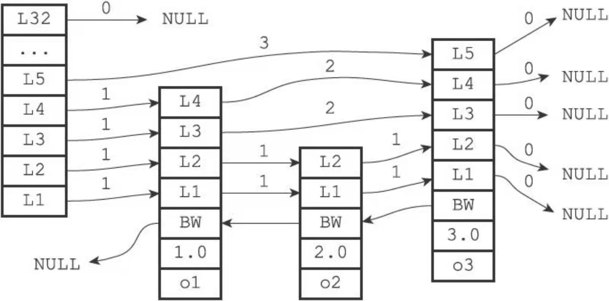

跳表是什么？

- 有序数据结构
- 类似于一种索引
- 分层


## 跳跃表的实现



### 跳跃表结点

`zskiplistNode`

```c
typedef struct zskiplistNode
{
  struct zskiplistLevel//层
  {
    struct zskiplistNode* forward;//即next指针
    unsigned int span;
  }level[];
  //后退指针
  struct zskiplistNode *backward;//即pre指针
  double score;//分值
  robj *obj;
}zskiplistNode;
```


1. 层 level数组
2. 前进指针（next指针）
3. 跨度
4. 后退指针
5. 分值和成员


### 跳跃表

```c
typedef struct zskiplist
{
  struct zskiplistNode *header,*next;
  unsigned long length;
  int level;
}zskiplist;
```


header:指向跳表头结点

tail：指向尾结点

level:记录目前跳跃表内，层数最大的那个结点的层数

Length:记录跳表长度


如何快速查找？二分法找层数？还是从最高层遍历？

加上字典更加快速