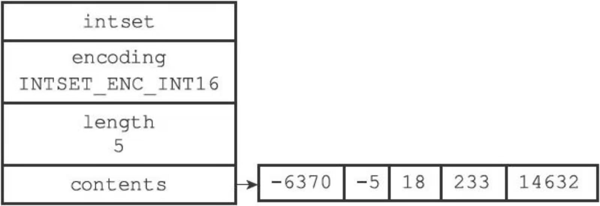

# 整数集合

当集合中只有整数时，这时候底层会使用整数集合作为底层实现

整数集合可以保存int16_t,int32_t,int64_t的整数值，保证集合中不会出现重复元素

```c
typedef struct intset
{
  uint32_t encoding;//决定contents数组的真正类型
  uint32_t length; //contents数组长度，有length个元素
  int8_t contents[]; //保存元素的值
}intset;
```

encoding的取值：

- `INTSET_ENC_INT16`
- `INTSET_ENC_INT32`
- `INTSET_ENC_INT64`:contents是一个int64类型的数组



## 升级

即插入元素类型高于当前数组类型（例如插入int64_t,而数组类型是int32_t)会升级


升级的过程：扩展数组，移动元素，添加新元素

1. 根据新元素的类型，==扩展== 底层数组空间大小（需要计算），为新元素分配空间（注意是扩展，不是重新分配一块，原来的移动就行了）
2. 将底层数组现有元素转为新元素类型，并==移动放入== 正确位置（从最后一个开始移动），保持有序性
3. 将新元素添加到数组中。


## 升级的好处

1. 提升整数集合的灵活性
2. 尽可能节约空间
   1. 用则扩展，不用则节约


为什么不用多个数组存不同类型的值，例如开int8_t, int16_t数组

我认为可能有以下原因（不一定准确）

1. 增加了设计的复杂性，使得整数集合类型臃肿
2. 不一定节约内存，若没有更高类型的数，另外几个数组仍然是浪费
3. 有符号类型不适用（因为最高位为1，很有可能16位的数比8位的小）
4. 限制高类型数组只能存高类型数，比如int16_t 只能存16位即以上数

