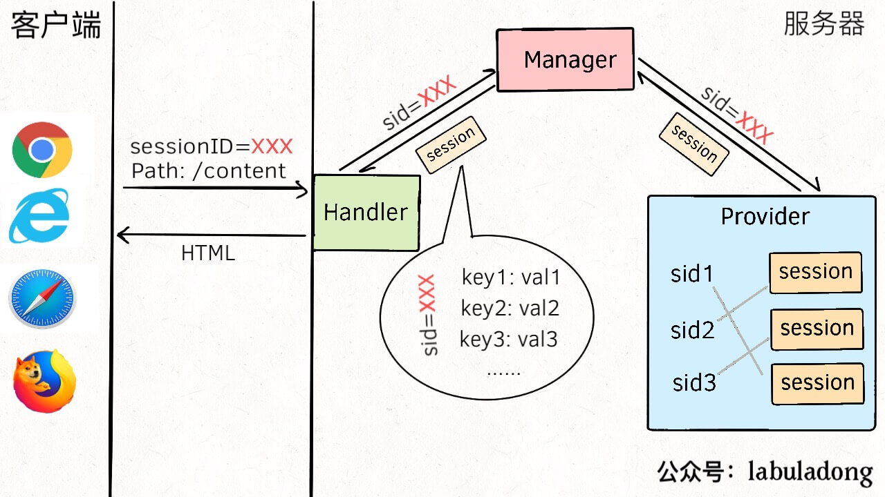

#第4章 Internet上的web服务器


## 访问DNS服务器


## HTTP通信


### HTTP请求

请求行

请求头

实体内容


请求行 : 请求方法+URI+version

- 请求方法

  | GET     | 请求指定的页面信息，并返回实体主体                           |
  | ------- | ------------------------------------------------------------ |
  | POST    | 向指定资源提交数据进行处理请求（例如提交表单或者上传文件）。数据被包含在请求体中。POST请求可能会导致新的资源的建立和/或已有资源的修改 |
  | HEAD    | 类似于 get 请求，只不过返回的响应中没有具体的内容，用于获取报头 |
  | PUT     | 上传、修改整个文件                                           |
  | PATCH   | 资源部分修改                                                 |
  | DELETE  |                                                              |
  | TRACE   |                                                              |
  | OPTIONS | 请求一些选项信息，允许客户端查看服务器的性能                 |
  | CONNECT |                                                              |
  |         |                                                              |

  幂等：多次连续，重复请求和只发送一次该请求组具有完全相同的效果

- URI

- 版本


## HTTP 应答


## 长短连接


- http到底有没有长短连接？

HTTP协议是基于请求/响应模式的，因此只要服务端给了响应，本次HTTP连接就结束了，或者更准确的说，是本次HTTP请求就结束了，根本没有长连接这一说。那么自然也就没有短连接这一说了。

HTTP分为长连接和短连接，其实本质上是说的TCP连接。

长连接是为了复用，这个在之前LZ就明白。那既然长连接是指的TCP连接，也就是说复用的是TCP连接。那这就很好解释了，也就是说，长连接情况下，多个HTTP请求可以复用同一个TCP连接，这就节省了很多TCP连接建立和断开的消耗。


HTTP本身不是连接，只是一个应用层的协议。

- TCP的长短连接

  - 短连接：每次通信时，创建 Socket;一次通信结束，调用 socket.close()。这就是一般意义上的短连接，短连接的好处是管理起来比较简单，存在的连接都是可用的连接，不需要额外的控制手段。
    - 例子：，client向server发起连接请求，server接到请求，然后双方建立连接。client向server 发送消息，server回应client，然后一次读写就完成了，这时候双方任何一个都可以发起close操作，不过一般都是client先发起 close操作。为什么呢，一般的server不会回复完client后立即关闭连接的，当然不排除有特殊的情况。从上面的描述看，短连接一般只会在 client/server间传递一次读写操作。
  - 长连接：每次通信完毕后，不会关闭连接，这样就可以做到连接的复用。长连接的好处便是省去了创建连接的耗时。（其实写在循环里面的是长链接，listenfd一直可以复用，不同的是connfd

  **短连接**:建立连接——数据传输——关闭连接 ... 建立连接——数据传输——关闭连接

  **长连接**:建立连接——数据传输 ...（保持连接）...数据传输——关闭连接

- HTTP的KeepAlive 和 TCP的KeepAlive 


## cookie与session

**cookie 可以认为是一个「变量」，形如** `name=value`，存储在**浏览器(客户端）**；

 **session** 可以理解为一种数据结构（多个类），多数情况是`「映射」（键值对） （sid，[key,value])`，**存储在服务器 **上。

### cookie

实际就是客户端的一个标签

ookie 的出现是因为 HTTP 是无状态的一种协议（服务器记不住你）。cookie就像你的标签，你发送数据服务器就能认识你。

- 何为cookie？
  - 其实就是给客户端打标签，是一个name=value的变量。（服务器可能设置多个cookie，因此可以是一组(键值对)

- cookie实现？
- 优点

- 存储

  cookie的存储存储在 HTTP header


### session

- 不是有cookie了吗？

  现在网页信息量大（例如电商购物车），而且结构也比较复杂，无法通过简单的 cookie 机制传递这么多信息，而且要知道 cookie 字段是存储在 HTTP header 中的，就算能够承载这些信息，也会消耗很多的带宽，比较消耗网络资源。

- 什么是session？

  session 就可以配合 cookie传递sessionID 解决上面cookie字段对于复杂数据结构和大的数据量的问题。

  例子：比如说一个 cookie 存储这样一个变量 `sessionID=xxxx`，仅仅把这一个 cookie 传给服务器，然后服务器通过这个 ID 找到对应的 session，这个 session 是一个数据结构，里面存储着该用户的购物车等详细信息，服务器可以通过这些信息返回该用户的定制化网页，有效解决了追踪用户的问题。

  是一种数据结构，即`（sid，[key,value])`

  

- 怎么实现？

  - 利用cookie传递唯一 `session ID`

  - session类

    ```cpp
    type Session interface {
        // 设置键值对
        Set(key, val interface{})
        // 获取 key 对应的值
        Get(key interface{}) interface{}
        // 删除键 key
        Delete(key interface{})
    }
    ```

    

  - Manager类（主要存储一些数据，数据结构）

    - 存储一些配置信息，比如 session 的存活时间，cookie 的名字等等

  - Provide类（实际工作）

    ```cpp
    type Provider interface {
        // 新增并返回一个 session
        SessionCreate(sid string) (Session, error)
        // 删除一个 session
        SessionDestroy(sid string)
        // 查找一个 session
        SessionRead(sid string) (Session, error)
        // 修改一个session
        SessionUpdate(sid string)
        // 通过类似 LRU 的算法回收过期的 session
        SessionGC(maxLifeTime int64)
    }
    ```

    

- 存储

  - 存储在服务器端
  - 占用服务器资源，因此有过期时间

- 优势和劣势


## HTTP安全

HTTP不安全

- http 使用明文
- http 无验证
- http 无法报文完整性证明

那我们是要修改http协议？没有必要，可以在TCP到应用层加个中间层来加密。因为不止http有这个问题。

因为在http上面就算加密，如果我获取的是tcp/ip报文没有加密，这也不安全呀

本质是上TCP/IP的不安全


### 通信使用明文，可能被窃听

#### TCP/IP是一个可能被窃听的网络

TCP/IP协议簇工作机制导致所有通信线路上都有可能遭到窥视

- 明文可能被窃听，加密的报文同样可能被窃听
- 加密处理后的报文还是能被看到


#### 加密处理防止被窃听

- 通信的加密
  - SSL 安全套接字层，为通信线路加密
  - TLS(transport layer security) 安全传输层协议，SSL的升级
  - SSL组合使用http被称为https（http secure）

- 内容的加密
  - 报文首部未加密，报文主体加密
  - 前提：客户端和服务端都具备加密和解密
  - 内容仍然可能被篡改

### 不验证通信方身份可能遭遇伪装

- 任何人都可发送请求
- 接收任何请求

如何解决？

HTTP无法确定通信方，但是SSL不仅能加密，同时也可以利用证书确定对方


### 无法确定完整性，可能被篡改

如何防止被篡改？数字证书


## HTTPS [安全与加密](/Users/matytan/Desktop/code/基础/网络/Linux高性能编程+网络协议/网络安全与加密.md)

什么是https= HTTP+加密+认证+完整性保护

- SSL组合使用http被称为https（http secure）

为什么要有HTTPS？

那我们是要修改http协议？没有必要，可以在TCP到应用层加个中间层来加密。因为不止http有这个问题。

本质是上TCP的不安全

什么是HTTPS呢


HTTP2.0

