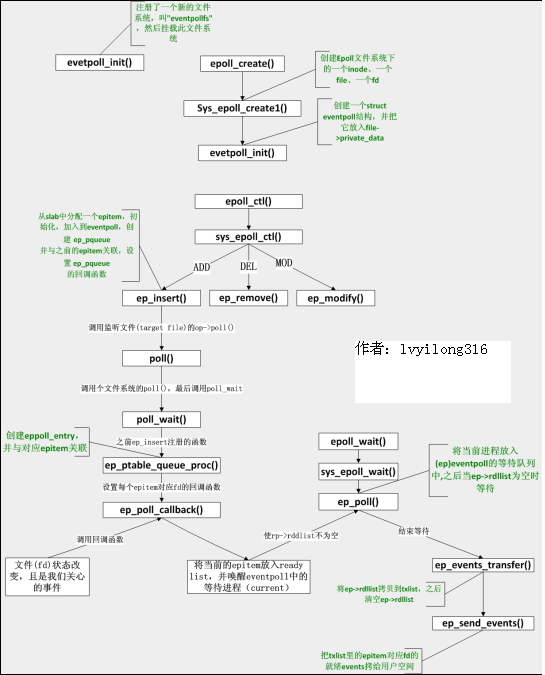

# Epoll 和 Poll ，select


## EPOLL实现

epoll机制实现了自己特有的文件系统eventpoll filesystem

内核保存已经拷入的fd呢？答对了，epoll就是自己保存拷入的fd，它的API就已经说明了这一点

- 不是 epoll_wait的时候才传入fd，而是通过epoll_ctl把所有fd传入内核再一起"wait"，这就省掉了不必要的重复拷贝。
- 其次，在 epoll_wait时，也不是把current轮流的加入fd对应的设备等待队列，而是在设备等待队列醒来时调用一个回调函数（当然，这就需要“唤醒回调”机制），把产生事件的fd归入一个链表，然后返回这个链表上的fd（就绪链表）。


### 1. 内核数据结构

```c
(1) struct eventpoll {  

    spinlock_t lock;  

      struct mutex mtx;  

      wait_queue_head_t wq;  /* Wait queue used by sys_epoll_wait() ,调用epoll_wait()时, 我们就是"睡"在了这个等待队列上*/

 wait_queue_head_t poll_wait;  /* Wait queue used by file->poll() , 这个用于epollfd本事被poll的时候*/

 struct list_head rdllist; /* List of ready file descriptors, 所有已经ready的epitem都在这个链表里面*/ 

 structrb_root rbr; /* RB tree root used to store monitored fd structs, 红黑树根节点所有要监听的epitem都在这里*/ 

epitem *ovflist;  /*存放的epitem都是我们在传递数据给用户空间时监听到了事件*/.


 struct user_struct *user; /*这里保存了一些用户变量,比如fd监听数量的最大值等*/  

};  
```

通过epoll_ctl接口加入该epoll描述符监听的套接字则属于socket filesystem，这点一定要注意。每个添加的待监听（这里监听和listen调用不同）都对应于一个epitem结构体，该结构体已红黑树的结构组织，eventpoll结构中保存了树的根节点（rbr成员）。同时有监听事件到来的套接字的该结构以双向链表组织起来，链表头保存在eventpoll中（rdllist成员）。

```c
//红黑树节点，监听的epitem
(2) struct epitem {  

    struct rb_node rbn;      /* RB tree node used to link this structure to the eventpoll RB tree */  

struct list_head rdllink;  /* 链表节点, 所有已经ready的epitem都会被链到eventpoll的rdllist中 */ 

    struct epitem *next;  

    struct epoll_filefd ffd;    /* The file descriptor information this item refers to */

    int nwait;   /* Number of active wait queue attached to poll operations */

    struct list_head pwqlist;  /* List containing poll wait queues */  

    struct eventpoll *ep;  /* The "container" of this item */ 

    struct list_head fllink; /* List header used to link this item to the "struct file" items list */ 

 struct epoll_event event;   /*当前的epitem关系哪些events, 这个数据是调用epoll_ctl时从用户态传递过来 */ 

};  
```


```c
(3) struct epoll_filefd {

struct file *file;

int fd;};
```


```c
(4)  struct eppoll_entry { /* Wait structure used by the poll hooks */

struct list_head llink; /* List header used to link this structure to the "struct epitem" */

struct epitem *base; /* The "base" pointer is set to the container "struct epitem" */

wait_queue_t wait; / Wait queue item that will be linked to the target file wait queue head. /

wait_queue_head_t *whead;/The wait queue head that linked the "wait" wait queue item */

};//注：后两项相当于等待队列

```


```c
//等待队列
(5)  struct ep_pqueue {/* Wrapper struct used by poll queueing */

poll_table pt;   // struct poll_table是一个函数指针的包裹

struct epitem *epi;

};
```


```c
(6) struct ep_send_events_data {

     /* Used by the ep_send_events() function as callback private data */

int maxevents;

struct epoll_event __user *events;

};
```




用户调用`epoll_create()`,返回一个epfd；

- `epoll_create()`调用`Sys_epoll_create1()`

- 调用`eventpoll_init()`注册一个新的文件系统`eventpollfs`

用户调用`epoll_ctl()`

- 调用`sys_epoll_ctl()`

## 关于Eventfd，signalfd，timerfd


### Eventfd

创建一个eventfd，这是一个计数器相关的fd，计数器不为零是有可读事件发生，read以后计数器清零，write递增计数器；

返回的fd可以进行如下操作：read、write、select (poll、epoll)、close。

```c
#include <sys/eventfd.h>
int eventfd(unsigned int initval, int flags);
```


- flags参数

  - **EFD_NONBLOCK**

  功能同open(2)的O_NONBLOCK，设置对象为非阻塞状态，如果没有设置这个状态的话，read(2)读eventfd,并且计数器的值为0 就一直堵塞在read调用当中，要是设置了这个标志， 就会返回一个 EAGAIN 错误(errno = EAGAIN)。效果也如同 额外调用select(2)达到的效果。

  - **EFD_CLOEXEC**

  这个标识被设置的话，调用exec后会自动关闭文件描述符，防止泄漏。如果是2.6.26或之前版本的内核，flags 必须设置为0

  

```c
#include<stdio.h>
#include<sys/eventfd.h>
#include<unistd.h>
#include<stdint.h>
#include<stdlib.h>
int createEventfd()
{
    //int evfd = eventfd(0,EFD_NONBLOCK|EFD_CLOEXEC);
    int evfd = eventfd(0,0);
    if(evfd<0)
    {
        printf("Failed in eventfd\n");
        exit(0);
    }
    return evfd;

}
int main()
{
    int weakfd = createEventfd();
    uint64_t one=0;
    printf("about to fork\n");
    int pid;
    if((pid=fork())<0)
    {
        printf("fork fail\n");
        exit(1);
    }

    else if(pid==0)
    {
            one = 1;
            write(weakfd,&one,sizeof one);
						//重新设置为3
            one = 3;
            write(weakfd,&one,sizeof one);
    }
    
    else
    {
        sleep(2);
        one = 1;
        read(weakfd,&one,sizeof one); //读取的实际上还是weakfd的，也就是weakfd是跨进程的，最后结果为4
        printf("%llu\n",(unsigned long long) one);
    }
    exit(0);
}
/*
输出：
about to fork
4
*/
```


### timerfd


### signalfd


