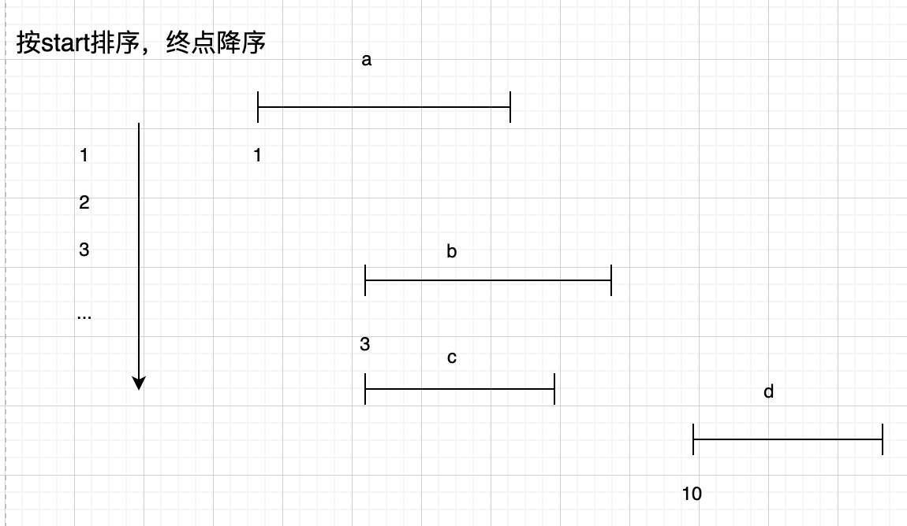

## 区间

两个思路：

1. 排序。对起点排序，画出图，观察情况

   

2. 画图


- 分析
  - a和b可以合并为更大空间
  - b和c，c被覆盖
  - abd与d完全不相干

使用lamda选择对哪个排序，是对起点排序还是终点？

起点升序，终点降序（即起点相同时，需要终点为降

```cpp
//三种情况 
//为什么终点降序？升序行不行或者不管顺序
//不行 因为我们从上到下去判断。上面的作为基准，判断下方的状态 看代码就懂了

class Solution {
public:
    int removeCoveredIntervals(vector<vector<int>>& intervals) {
        //起点升序排序，终点降序
        sort(intervals.begin(),intervals.end(),
                      [](vector<int>&a,vector<int>&b){
                          if(a[0]==b[0]) return a[1]>b[1]; //终点降序
                          return a[0]<b[0];//起点升序
                      });
        int n = intervals.size();	
        int left = intervals[0][0];//起点
        int right = intervals[0][1];
        int res = 0;
        //三种情况
        for(int i=1;i<n;++i)
        {   
            vector<int> inval = intervals[i];//取i行比较
            
            //第一种情况 覆盖
            if(inval[0]>=left&&inval[1]<=right)
                res++;

            //第二种情况 相交 
            else if(inval[0]>=left&&inval[1]>right)
            {
                right = inval[1]; //合并 
            }

            else if(inval[0]>left&&inval[1]>right) //不相交
            {
                //更新区间
                left = inval[0];
                right = inval[1];
            }
        }
        return n-res;
    }
```


### [56. 合并区间](https://leetcode-cn.com/problems/merge-intervals/)


```cpp
class Solution {
public:
    vector<vector<int>> merge(vector<vector<int>>& intervals) {
        //起点排序
        sort(intervals.begin(),intervals.end(),
            [](vector<int> &a,vector<int> &b){
                if(a[0]==b[0]) return a[1]>b[1];
                return a[0]<b[0];
            });
        vector<vector<int>> res;

        res.push_back(intervals[0]);

        for(int i=0;i<intervals.size();i++)
        {
            vector<int> curr = intervals[i];
            vector<int> &last = res.back();//取最后一个元素 注意引用 否则拷贝无法修改原副本
            
            if(curr[0]<=last[1])
            {
                last[1] = max(last[1],curr[1]);
            }

            //无交集
            else
            {
                res.push_back(curr);
            }
        }
        return res;

    }
};
```

