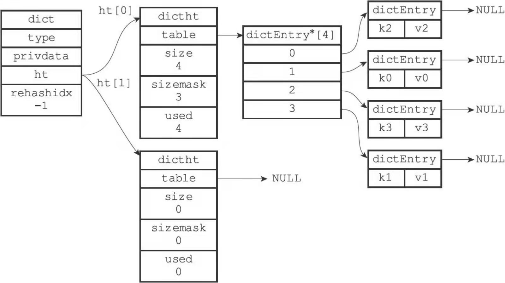

# 字典

什么是字典？别名好像很多：map，关联数组，符号表 （那哈希表又是啥？）

字典和哈希键之间的关系

- 字典不一定使用哈希
- 例如c++的map使用红黑树(为了有序)

字典是多个键值对组成

## 字典的实现

哈希表，哈希表结点，字典三者怎么实现？


一个键值对集合----可以想象成一个数组里面放的键值对

那么这个数组怎么放键值对呢？按键的值直接放吗？显然不行太大了，需要hash一下呀

hash之后冲突怎么办呢？也就是到数组的同一个下标了？

- 解决冲突1，线性散列
- 拉链法（redis使用）

### 哈希表


```c
typedef struct dictht //字典哈希表，注意字典不一定必须是哈希组成
{
  dictEntry **table;//哈希表数组,每一个元素指向的是一个dictEntry类型的结构的指针
  //dictEntry是一个指针 说明本身它应该是个数组（链表）
  unsigned long size; //2^n
  
  //哈希表大小掩码
  unsigned long sizemask; //总是等于size-1 计算索引用
  unsigned long used;//已有结点（键值对）的记录，注意是所有的链表结点，计算负载因子
}dictht;
```

`dictEntry哈希表结点`里面是啥？保存着一个键值对！

`sizemask`和hash值一起决定了键值对放在table数组的哪个位置

这结构有点大~~ 

### 哈希表结点

`dictEntry`结构

首先思考几个问题

- 哈希表的key和value怎么存
  - key用一个指针void* 因为是任意类型
  - value可以用只void*（8字节），为啥不用一个union呢，可以加个8字节的整数啊，少一次间接寻址（redis这次算良心）

- 哈希表结点的冲突怎么解决？哈希值相同都使用这个节点，那么就一个结点链起来（拉链法）
  - 因此应该有next指针

```c
typedef struct dictEntry
{
  void *key;
  //value 如果是整数类型可以少一次计算
  union value
  {
    void* val;
    uint_64 _tu64;
    int_64 _ts64;/
  }
  struct dictEntry *next;//解决冲突
}dictEntry;
```


### 字典实现

多态字典的实现 ---自然少不了函数指针~


```c
typedef struct dict
{
  dictType *type;
  void *privdata;
  dictht ht[2];//为什么需要两个哈希表？
  
  int rehashidx;//默认为-1
}dict;
```


`dictType`是个什么东东？

`*privdata`是啥？ 实际是dictType使用的

 `dictht ht[2];`//为什么需要两个哈希表？rehash使用

一般只使用一个ht[0]，在需要rehash时，需要重新转移，要借助ht[1]

`rehashidx`:记录rehash的进度

```c
typedef struct dictType
{
  //哈希函数
  unsigned int (*hashFunction)(const void *key);
 	void * (*keyDup)(void *privdata,const void *key);
	void * (*valDup)(void *privdata,const void *key);
	void * (*keyCompare)(void *privdata,const void *key1,const void *key2);
  //销毁键的函数
  void * (*keyDestructor)(void *privdata,const void *key);
  //销毁值的函数
  void * (*valDestructor)(void *privdata,const void *key);
}dictType;
```


## hash算法

如何讲一个新的键值添加到字典？

- 根据键值对的值算出哈希值和索引值。
- 根据索引值，将包含新键值对的**哈希表节点 **（dictEntry）放到**哈希表数组 **指定索引上面

```c
hash = dict->type->hashFunction(key);//算出哈希值
index = hash & dict->ht[x].sizemask; //根据不同情况选择ht[0]或者ht[1]
```


1. & 有什么作用？为什么哈希函数求出来的哈希需要求 与
2. 按道理来说，就算hash出来是一个跟长度无关的，因此我们需要限制到哈希表数组之类，是求余

size为什么必须是$2^n$​​？

- 就是因为这里转换求与操作（sizemask=$2^n-1$​​)此时为全1，与它求&之后

假设哈希为 1011 1111，此时sizemask为7 结果为0000 0111转换为了7 ，其实起到了求余mod一样的效果，且位位运算效率更高

- 为了提高效率使用了位运算

`hashFunction` redis使用的什么？MurmurHash

## 解决冲突

有很多种类 

- 开放地址法

- redis使用的是链地址法
- 再散列法
- 建立公共溢出区

## rehash

什么是rehash？对哈希表大小进行相应的扩展和收缩

为啥要rehash？

- 避免负载因子（load factor）过大或者过小
  - Load_factor = ht[0].used / ht[0].size;
- 键值太多，导致Load_factor过小，则需要扩展哈希表大小
- 键值太少，导致load_factor过大，浪费空间，需要收缩

#### 如何rehash？

触发条件？

负载因子怎么算？

1.**空间分配： **

Ht[1]的空间如何分配--->保证rehash，size后仍然是$2^n$

​	n取决于第一个大于等于！！！

- 扩展 ：那么 `ht[1]` 的大小为第一个大于等于$ ht[0].used * 2^{2^n}$​​
  - `ht[0].used` 当前的值为 `4` ， `4 * 2 = 8` ， 而 `8` （2^3）恰好是第一个大于等于 `4` 的 `2` 的 `n` 次方， 所以程序会将 `ht[1]` 哈希表的大小设置为 `8` 。 图 4-9 展示了 `ht[1]` 在分配空间之后， 字典的样子。
  - 扩展条件：
    - 哈希负载因子大于等于1，且没有执行bgsave和bgrewriteof命令
    - 正在执行bgsave和bgrewriteof命令，并且哈希负载因子大于等于5（为什么能大于1？因为不是看ht的已有dictEntry数量，而是每个槽连接了一条链表，总的链表结点数，即used呀）
- 收缩(负载因子<0.1时）：那么 `ht[1]` 的大小为第一个大于等于 $(ht[0].used)^{2^n}$​​​​​​​​

理解：

- 如果执行的是**扩展操作**，那么ht[1]哈希表的大小为 **第一个大于等于ht[0].used \* 2的 2的n次方幂，即第一个大于等于ht[0]哈希表键值对数量两倍的2的n次方幂**
- 如果执行的是 **收缩操作**，那么ht[1]哈希表的大小为**第一个大于等于 ht[0]哈希表键值对数量的2的n次方幂**

为啥这么设计？为了限制size始终是$2^n$！！！！即sizemask=$2^n-1$

size为什么必须是$2^n$​？

- 求下标原因，用的实际是求&,位运算效率更高
- 对齐，性能更好？

**2.移动： **

- 将ht[0]中的数据rehash到ht[1]中，即重新计算键的哈希值和索引值，然后放到对应位置

**3.清空，设置，重分配 **

清空ht[0]，释放ht[0]，并将ht[1]设置为ht[0]，并在 ht[1]新创建一个空白哈希表数组，为下次rehash做准备


例子：

1. ht[0]满了，准备扩展



2. 扩展之后，ht[1] 的$size=4 * 2^{2^0}=8$​​=2的3次方

   

3. 移动元素，重新计算

   

4. 释放ht[0]，设置ht[1]为ht[0]，然后重新分配ht[1]


#### 哈希表的扩展与收缩

扩展的条件

- 哈希负载因子大于等于1，且没有执行bgsave和bgrewriteof命令
- 正在执行bgsave和bgrewriteof命令，并且哈希负载因子大于等于5（为什么能大于1？因为不是看ht的已有dictEntry数量，而是每个槽连接了一条链表，总的链表结点数，即used呀）
- 为啥需要的装载因子不同？
  - 执行bgsave和bgrewriteof时会创建子进程，而子进程是使用copy-on-write写时拷贝优化，因此提高扩展所需负载因子避免在子进程存在期间进行哈希表扩展（否则触发子进程写入）
  - 写时拷贝的优点和缺点？
  - 子父进程到底是什么关系？unix高级编程

收缩的条件：


## 渐进式rehash

为什么需要渐进式rehash？一次弄完不好吗？

- 当数量太大的时候，一次rehash耗时太久了~

怎么个渐进法？

- 扩展或者收缩时不是一次将ht[0]的数据全部rehash到ht[1]，不是一次性，集中的
- rehashidx的作用起来了~


### 过程

1. 为ht[1]分配空间，让字典同时持有ht[0]和ht[1]两个hash表。（ht[1]分配多大呢？按上面扩展和收缩的规则来呀）
2. 字典中维持一个rehashidx,将它的值设置为0，rehash正式工作。
3. 每次对字典执行添加，删除，查找，更新时，除了执行这些操作，还会顺带将ht[0]在哈希表在rehashidx索引上dictEntry（所有键值对）**移动 （ht[0]中的数据无了）**到ht[1],rehash完成后，rehashdix属性值加1
4. 不断执行，ht[0]的哈希数组为空，即完成，然后释放ht[0]，重新设置ht[1]为ht[0]

