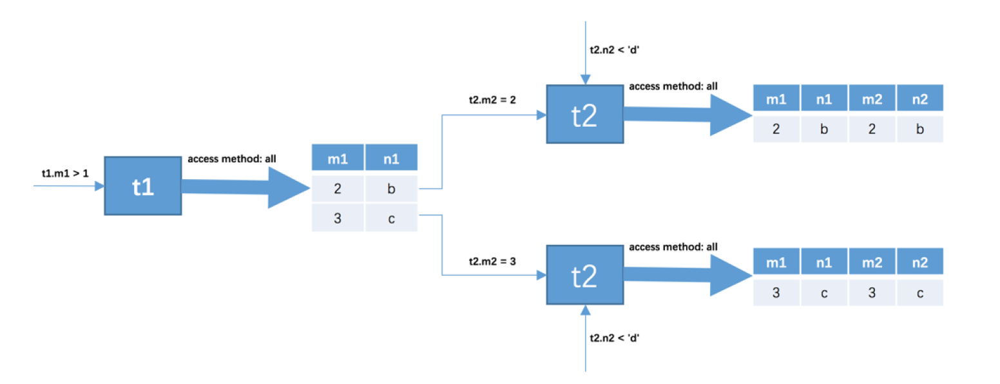

## 联结的本质

联结：join 

若没有条件 使用笛卡尔积进行两个表连接

### 连接过程

假设有两个表 t1 t2

```sql
select * from t1,t2;//笛卡尔积连接
2.
select * from t1,t2
where t1.m1>1 and t1.m1=t2.m2 and t2.n2<'d'
```


- 确定一个要查询的表：驱动表 。单表查询中先处理驱动表的条件查询

  

- 根据驱动表的结果集每一条记录，分别需要到t2表中查找匹配的记录，t2称之为被驱动表，利用t1.m1=t2.m2条件匹配：

  - t1.m1=2 ，条件为t1.m1=t2.m2，即t2.m2=2，所以t2表有了t2.m2=2 and t2.n2<'d'两个条件来查找t2的记录



## 内联结

对于两个表，驱动表中的记录若在**被驱动表中没有记录**  不加入到结果集

反正都不加，因此谁是驱动表都无所谓

where 和 on等价

## 外联结

对于两个表，驱动表中的记录即使在**被驱动表中没有记录 ** 也需要加入到结果集

ON是专门为外联结驱动表中的记录在被驱动表中没有记录时不加入结果集提出的

### 左外联结

选择左侧的表为驱动表

### 右外联结

选择右侧的表为驱动表