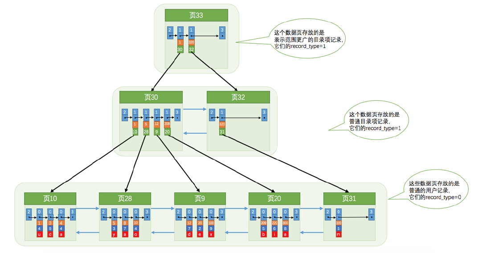

## 回顾

数据页之间的联系---双向链表

页中每个记录直接的联系---单链表，但是找很慢怎么办？

- 每个页，生成了一个页目录，页目录里面的entry（槽）存着每个分组里面最大主键值（具体细节，例如每个组中有多少个元素，其实最大key值那个记录中会记录（我称他为组长吧）
- 利用二分查找即可

## 没有索引的查找-远古时期

### 在一个页中查找

- 主键为搜索条件 有buff（页目录）
- 非主键为搜索条件 无buff 只能硬着头皮遍历所有记录

### 在多个页中查找

先定位记录所在页 ---如何定位？

在找对应页中的对应记录--- 这个参照上面

- 由于没有索引 只能一个页一个页的遍历（在双向链表中）

- 在页中又按上面方法查找对应记录看能不能找的到

  即：遍历所有页，遍历页中的记录（真慢，如果要找的在最后一个页的最后）

就跟查没有索引表的字典一样 ：先看第一页，然后看第一页有没有对应的字，如果没有再翻第二页......这得翻到猴年马月。

## 索引

页目录项需要什么条件？

维持这个条件需要做什么？

### 上古时期---一个简单的索引方案

类似于页目录存储最大key值记录，我们也可以每一个页对应一个目录项存储：主键值和页号，存在一个连续的空间之中（例如数组）

1. 每一个结构项存储了每一个页中最小的主键和页号

2. 然后按照二分法查找对应的结构中的页号，找到对应的页号

   

实现索引，发现普通索引目录会出问题：

- 随着记录越来越多，连续空间要求越来越多

### 现代----INnoDB的索引方案

后面发现，这玩意和记录一样呀，完全也可以用页来存储（有点操作系统分页，页目录那味了）

用页专门存储目录记录项（目录记录项存的是key和页号）

record_type 为1 表示专门存目录记录项的页

1. 链表组织

2. 更高级的组织

   1. bst平衡二叉树
   2. b+树（树更矮）

   

#### 聚簇索引

数据即索引！

#### 非聚簇索引

